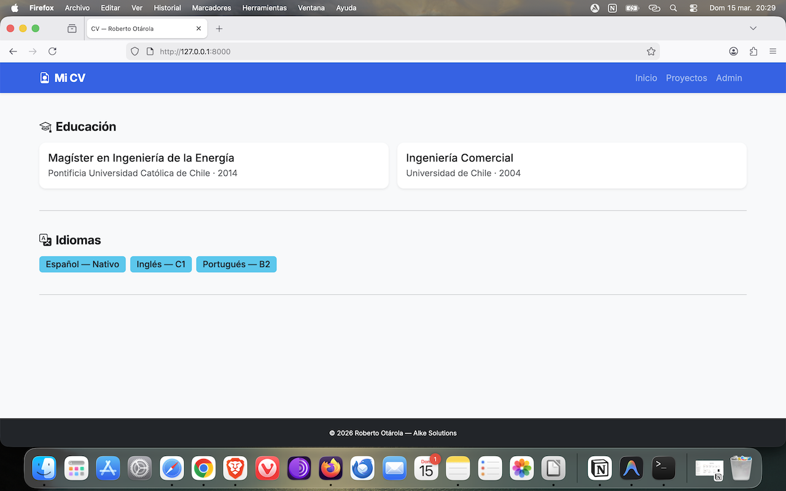
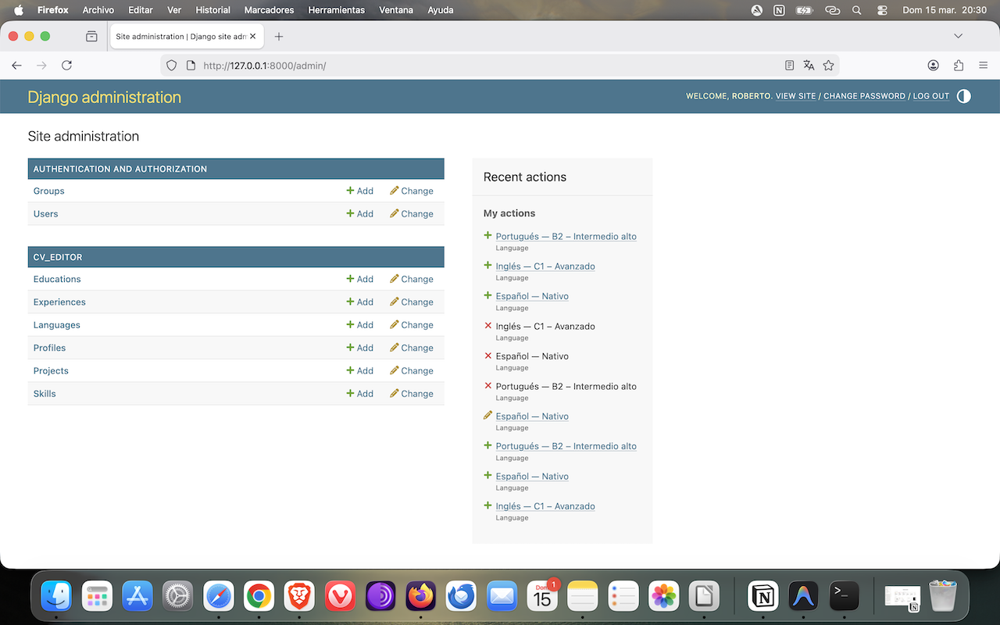
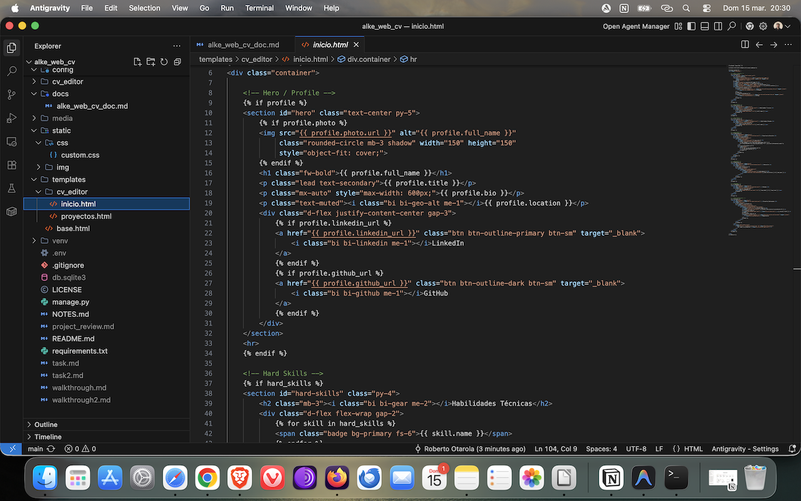

# 📝 Alke Web CV - Aplicación Web Django
**Curso:** Desarrollo de Aplicaciones Fullstack Python Trainee  
**Módulo:** Desarrollo de Aplicaciones Web con Python Django  
**Profesor:** Ariel Rosenamnn  
**Alumno:** Roberto Otárola

---

## Parte 1 — Documento Explicativo

### 1. Descripción del proyecto

`alke_web_cv` es una aplicación web construida con Django 6.0 que permite editar y visualizar un Curriculum Vitae dinámico. Los datos del CV se administran desde el panel de administración de Django (`/admin/`) y se renderizan en dos páginas públicas: la página principal (`/`), que muestra el CV completo, y la galería de proyectos (`/proyectos/`). El diseño usa Bootstrap 5 con un esquema de colores personalizado.

---

### 2. ¿Cómo instalar y ejecutar el proyecto?

```bash
# 1. Clonar el repositorio
git clone https://github.com/RobertoOtarola/alke_web_cv.git
cd alke_web_cv

# 2. Crear y activar el entorno virtual
python -m venv venv
source venv/bin/activate        # Windows: venv\Scripts\activate

# 3. Instalar dependencias
pip install -r requirements.txt

# 4. Configurar variables de entorno
# Crear el archivo .env en la raíz del proyecto con el siguiente contenido:
# SECRET_KEY=django-insecure-reemplaza-con-una-clave-segura
# DEBUG=True

# 5. Aplicar migraciones
python manage.py migrate

# 6. Crear superusuario (para acceder al panel Admin)
python manage.py createsuperuser

# 7. Iniciar el servidor de desarrollo
python manage.py runserver
```

URLs disponibles:

| URL | Descripción |
|---|---|
| `http://127.0.0.1:8000/` | CV completo |
| `http://127.0.0.1:8000/proyectos/` | Galería de proyectos |
| `http://127.0.0.1:8000/admin/` | Panel de administración |

---

### 3. Estructura del proyecto

```
alke_web_cv/
├── manage.py                        # Comando central del proyecto Django
├── requirements.txt                 # Dependencias (django, pillow, python-decouple)
├── .env                             # Variables de entorno — NO versionar
├── .gitignore                       # Archivos excluidos del repositorio
│
├── config/                          # Paquete de configuración del proyecto
│   ├── settings.py                  # Configuración global (BD, apps, templates, static)
│   ├── urls.py                      # Router principal — conecta admin y cv_editor.urls
│   ├── wsgi.py                      # Punto de entrada para servidores WSGI
│   └── asgi.py                      # Punto de entrada para servidores ASGI
│
├── cv_editor/                       # App principal del CV
│   ├── models.py                    # 7 modelos: Profile, Skill, Experience, Achievement,
│   │                                #            Education, Project, Language
│   ├── views.py                     # index (CV completo) y project_list (galería)
│   ├── urls.py                      # Rutas: / → index, /proyectos/ → project_list
│   ├── admin.py                     # Registro de modelos con list_display y AchievementInline
│   ├── apps.py                      # Configuración de la app
│   └── migrations/
│       └── 0001_initial.py          # Primera migración — crea las tablas en SQLite
│
├── templates/
│   ├── base.html                    # Layout base: navbar sticky, bloques, Bootstrap 5 CDN
│   └── cv_editor/
│       ├── inicio.html              # CV: Hero, Habilidades, Experiencia, Educación,
│       │                            #    Idiomas, Proyectos destacados
│       └── proyectos.html           # Galería completa de proyectos en cards Bootstrap
│
├── static/
│   └── css/
│       └── custom.css               # Variables CSS y sobrescritura de Bootstrap
│
└── media/                           # Archivos subidos por el usuario (fotos de perfil)
```

---

### 4. Flujo de una petición en Django

Cuando un usuario visita `http://127.0.0.1:8000/` ocurre lo siguiente:

1. **El navegador envía una petición HTTP GET** al servidor de desarrollo de Django.
2. **Django lee `ROOT_URLCONF`** (`config/urls.py`) y recorre la lista de `urlpatterns` buscando una coincidencia con la URL solicitada.
3. **Coincide con `path('', include('cv_editor.urls'))`**, por lo que Django delega la resolución a `cv_editor/urls.py`.
4. **En `cv_editor/urls.py`**, la URL vacía `''` coincide con `path('', views.index, name='index')`.
5. **Django ejecuta la función `index(request)`** en `cv_editor/views.py`. Esta función consulta la base de datos usando el ORM (`Profile.objects.first()`, `Skill.objects.filter(...)`, etc.) y construye un diccionario de contexto.
6. **`render(request, 'cv_editor/inicio.html', context)`** combina el template con el contexto: Django busca `inicio.html`, que extiende `base.html` mediante `` y rellena los bloques `` con los datos del contexto.
7. **Django devuelve una respuesta HTTP 200** con el HTML generado. El navegador lo renderiza, carga `custom.css` desde `/static/css/custom.css` y Bootstrap desde el CDN.

---

### 5. Dificultades encontradas y cómo se resolvieron

**Dificultad 1 — 404 en `/proyectos/`**  
La URL `/proyectos/` devolvía 404 aunque estaba correctamente definida en `cv_editor/urls.py`. La causa fue una doble definición de `urlpatterns` en `config/urls.py`: la primera incluía `cv_editor.urls`, pero la segunda (solo con la ruta de admin) la sobreescribía. Django solo procesa el último valor asignado a `urlpatterns`. La solución fue eliminar el bloque duplicado y dejar una única definición consolidada.

**Dificultad 2 — `SECRET_KEY` y `DEBUG` ignorados desde `.env`**  
Las variables cargadas con `python-decouple` al inicio de `settings.py` eran sobreescritas por valores hardcodeados más abajo en el mismo archivo. La solución fue eliminar las líneas duplicadas, manteniendo únicamente las llamadas a `config()`.

**Dificultad 3 — `venv/` y `.env` incluidos en el ZIP**  
El primer ZIP de entrega incluía la carpeta del entorno virtual (innecesaria y pesada) y el archivo `.env` con la clave secreta. Se regeneró el ZIP excluyendo explícitamente estos archivos con los flags `--exclude` de `zip`.

---

## Parte 2 — Capturas de pantalla requeridas

| # | Captura | Vista previa |
|---|---|---|
| 1 | Página principal en el navegador |  |
| 2 | Panel de administración Django |  |
| 3 | Código del editor |  |

---

*Documento preparado bajo criterios del Módulo 6 — Alke Solutions / Desarrollo Fullstack Python.*
